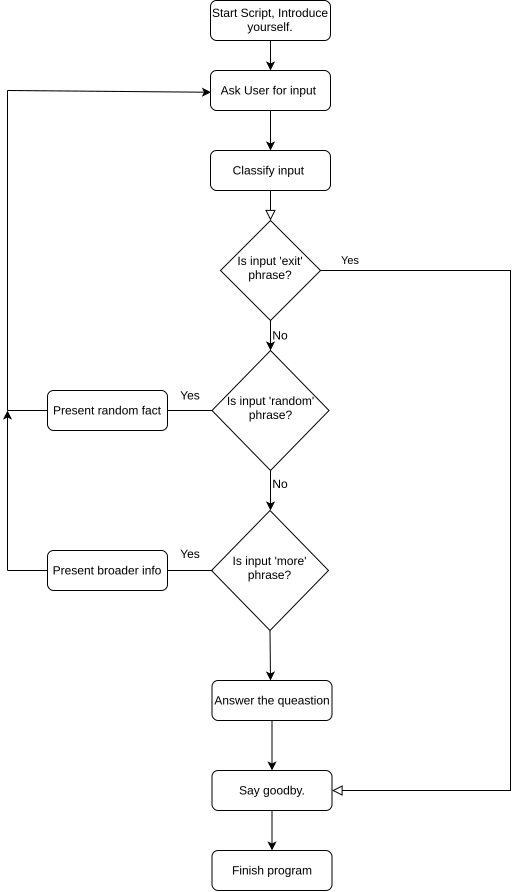
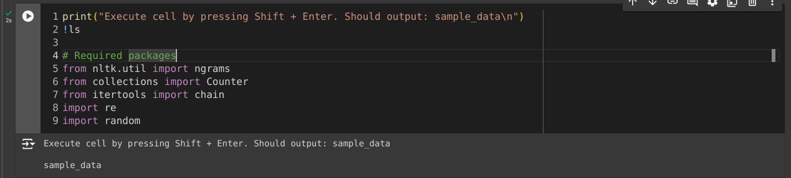
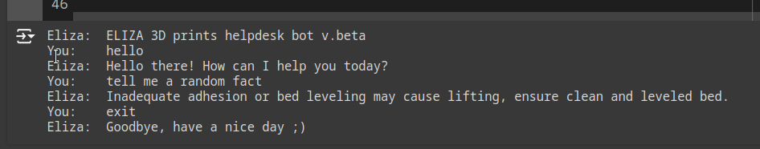
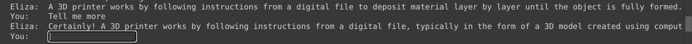

# ELIZA 3D prints helpdesk assistant project

The project is meant to recreate an original 1964 AI model called ELIZA [[Wikipedia]](https://en.wikipedia.org/wiki/ELIZA). It is written in Python language and, as opposed to the original one, is meant to help troubleshoot 3D printing problems.

> This project was made for subject Knowledge Representation in Artificial Intelligence (KRAI). Summer semester, 2024 by Aleksander Smolarski

## 1. Introduction
3D printing is a satisfactory hobby that brings a lot of joy. Unfortunately, there are several issues which most likely will be encountered by beginners, especially on cheaper printers. 

`ELIZA 3D prints` is meant to help users troubleshoot these problems by providing simple hints on what can be wrong with their setup. At the same time, it can provide basic info on 3D printing as a general hobby, eg. the construction of a printer. 

## 2. How it works

It uses a simple comparison of concerns provided by the user with the stored database. When it finds the best match, it prints the solution to that concern. 

Technically speaking it finds the intersection of two strings and based on a number of common words it assigns the score to each entry. Then, finds the highest-graded response and provides it as an output.

_Figure 1. Flow chart of the model._

## 3. Execution/running

To run the ELIZA it is required to have Python 3.x installed OR a web browser with an internet connection. 

### 3.1 Local execution

Download the `new_Aleksander_Smolarski_ELIZA_3D_prints.py` file from the repository and run it by executing 

`python3 script_name.py`

in terminal/cmd.

### 3.2 Cloud execution using [Google Colab](https://colab.research.google.com)

Open [https://colab.research.google.com](https://colab.research.google.com) (Google account required), click:
`File` > `Upload Notebook` > Browse for the file form repository named `new_Aleksander_Smolarski_ELIZA_3D_prints.ipynb`.

Then, follow the first cell instructions. Left-click on the cell starting with `print()` just below the instructions cell. Press Shift+Enter to start executing the cell. This may take a few seconds since the virtual machine has to launch in the background. 

_Figure 2. _Collab instructions that are required to_ start working._

Then execute every next cell up to the Sources section. The cell below `main`()` is the key-cell which will make ELIZA speak.

## 4. Usage and keywords

To start the conversation, you can enter any 'hello'-like phrase to say Hi. Example can be: 
> `Hello`, `Hi`, `Good morning`, etc

_Figure 3. Example of initial 'hello' conversation_

To ask any 3D printing-related question just type it in. Example can be:

> `How does 3D printing work?`,`What is a slicer?`,`Uneven filament diameter variations`,`Layer shifts during printing`, etc.

You can go on with the next question, or ask ELIZA to say more about the topic, by asking it with, for example following phrases:

> `Tell me more`, `Expand topic`, `Go on`, etc.

If a user wants to hear random a fact not related to the conversation, can type:

> `tell me a random fact`, `tell me something interesting`, `random fact` 

To end the conversation ( and the script execution ), say goodbye:

> `Thanks`,`Goodbye`,`See you later`, `bye`, etc.

## 5. Why 3D printing theme of ELIZE is not giving the result as good as the original psychotherapist mode (DOCTOR script)

According to [[4]](https://en.wikipedia.org/wiki/ELIZA): 

"[...] ELIZA simulated conversation by using a pattern matching and substitution methodology that gave users an illusion of understanding on the part of the program, but had no representation that could be considered really understanding what was being said by either party."

The presented program has the same approach. For the original ELIZA most common script was DOCTOR. It was supposed to mimic the conversation between the patient and psychotherapist on the first meeting. It had quite a positive impact and it was not uncommon to hear people saying that it could actually help people. 

Unfortunately, the 3D printing theme requires another approach to conversation. For the psychotherapist it can be assumed several responses will cover most of the phrases patient can ask. At the same time, a doctor during such a conversation is more meant to listen and ask leading short questions than lead the conversation. For troubleshooting 3D printing problems it is better to hear more from ELIZA answering the short question of a user. 

The difference in approaches makes this topic for ELIZA less addictive and effective. this means the very thin layer of 'theater play' making conversation human-like vanishes after just a few responses. 

## 6. Sources

[1] https://stackoverflow.com/questions/25977673/find-matching-phrases-and-words-in-a-string-python

[2] https://www.youtube.com/watch?v=9mD_MM5MQSY

[3] https://stackoverflow.com/questions/25977673/find-matching-phrases-and-words-in-a-string-python

[4] https://en.wikipedia.org/wiki/ELIZA

[5] https://github.com/rdimaio/eliza-py?tab=readme-ov-file#elizapy
